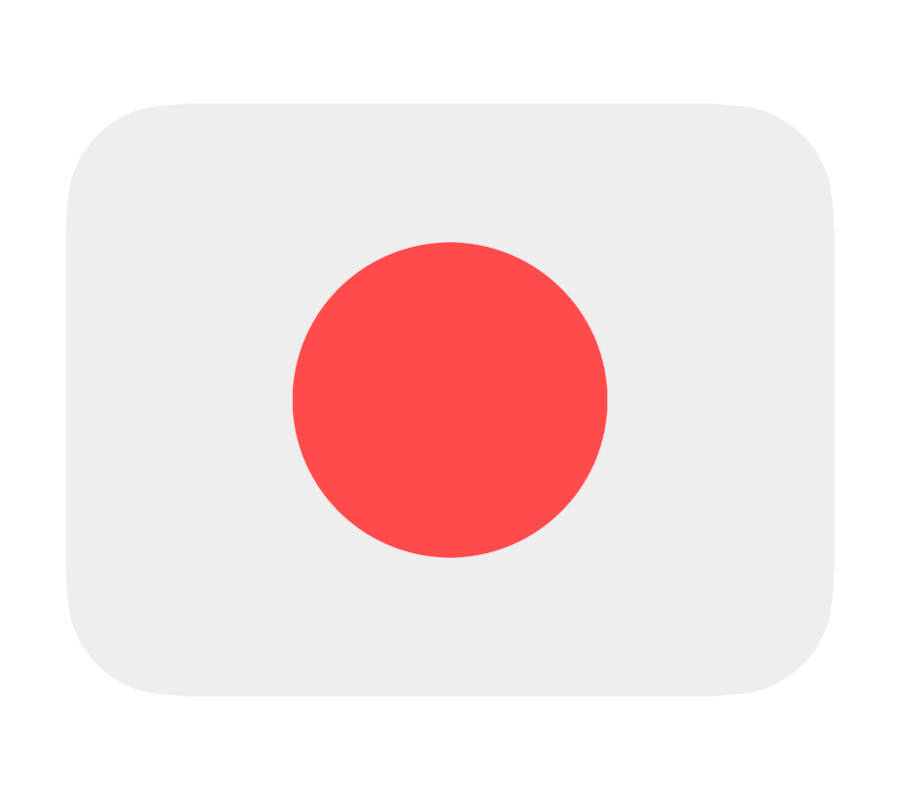
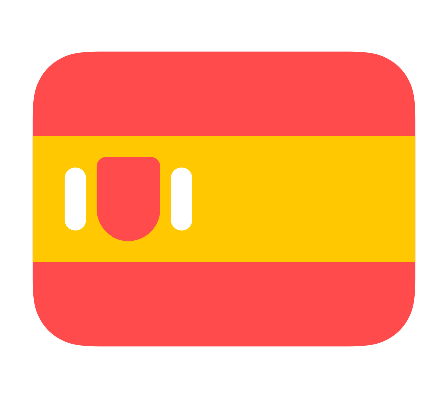

## Hi there 👋, my name is Adi 

## 🙋‍♂️ About me

I'm from Romania 🇷🇴, currently based in Cluj-Napoca. I'm passionate about Python, automation, software testing, and building efficient solutions 💻. When I'm not coding or learning new technologies, I enjoy playing video games 🎮, watching sci-fi movies 🎬, traveling ✈️, and exploring how things work in the world around me. I’m always eager to grow, innovate, and contribute to cutting-edge engineering projects!

## 🌱 I’m currently learning

<!--
**adiboagiu3/adiboagiu3** is a ✨ _special_ ✨ repository because its `README.md` (this file) appears on your GitHub profile.

Here are some ideas to get you started:

- 🔭 I’m currently working on ...
- 🌱 I’m currently learning ...
- 👯 I’m looking to collaborate on ...
- 🤔 I’m looking for help with ...
- 💬 Ask me about ...
- 📫 How to reach me: ...
- 😄 Pronouns: ...
- ⚡ Fun fact: ...
-->
